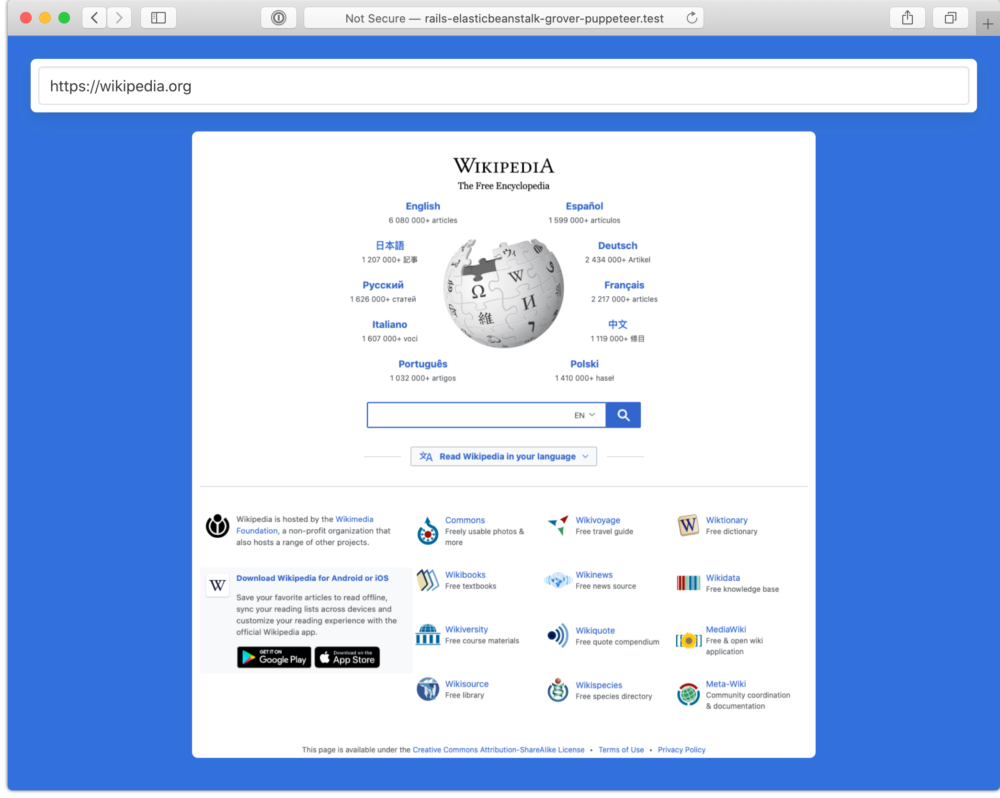

# Screenshot URLs with Puppeteer on Elastic Beanstalk

This demo app uses the Grover gem to get a screenshot of a URL using Puppeteer; headless Chromium.

Setting it up to work on Elastic Beanstalk proved to be difficult with many missing dependencies in Amazon Linux 2.

The basics for a Rails app though are;
- `bundle add grover`
- `yarn add puppeteer`
- See `config/initializers/grover.rb` for better defaults like `viewport` `width` and `height`, `full_page` etc.
- See `.ebextensions/packages.config` for the `yum` dependencies

